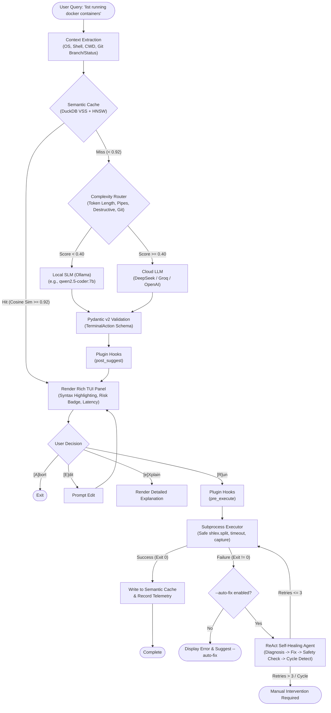

# 🤖 aikord-cli

[](https://opensource.org/licenses/Apache-2.0)
[](https://www.python.org/downloads/)
[](docs/index.html)
[](#-dynamic-complexity-router)
[](#-semantic-vector-caching-duckdb-vss)
[](#-defense-in-depth-safety-architecture)

> **Open-source, subscription-free AI terminal copilot with local SLMs, sub-10ms semantic vector caching, dynamic cloud routing, and self-healing execution.**
>
> 🌐 **Interactive Web Documentation & Sandbox**: Open [`docs/index.html`](docs/index.html) or run `python -m http.server 8000 --directory docs` to launch the live Developer Portal with interactive terminal playground, visual configurator, and search.

`aikord-cli` is a fast, privacy-first, developer-centric alternative to proprietary terminal assistants (like GitHub Copilot CLI). It translates natural language intents into accurate, shell-tailored CLI commands, validates safety before execution, monitors performance with zero-overhead telemetry, and automatically repairs broken commands using a **ReAct (Reason + Act)** self-healing loop.

---

## 📑 Table of Contents

- [Key Highlights](#-key-highlights)
- [System Architecture](#-system-architecture)
- [How It Works](#-how-it-works)
  - [1. Context-Aware Prompt Injection (Terminal RAG)](#1-context-aware-prompt-injection-terminal-rag)
  - [2. Semantic Vector Caching (DuckDB VSS + HNSW)](#2-semantic-vector-caching-duckdb-vss--hnsw)
  - [3. Dynamic Complexity Router (MoE Heuristic)](#3-dynamic-complexity-router-moe-heuristic)
  - [4. Defense-in-Depth Safety Architecture](#4-defense-in-depth-safety-architecture)
  - [5. Autonomous ReAct Self-Healing Loop](#5-autonomous-react-self-healing-loop)
  - [6. Extensible Plugin Hook Architecture](#6-extensible-plugin-hook-architecture)
  - [7. Production Observability & Telemetry](#7-production-observability--telemetry)
- [Installation & Quickstart](#-installation--quickstart)
  - [Prerequisites](#prerequisites)
  - [Install from Source](#install-from-source)
  - [Local SLM Setup (Ollama)](#local-slm-setup-ollama)
  - [Cloud Setup (DeepSeek / Groq / OpenAI)](#cloud-setup-deepseek--groq--openai)
- [Command Reference](#-command-reference)
  - [`aikord suggest`](#aikord-suggest)
  - [`aikord explain`](#aikord-explain)
  - [`aikord cache`](#aikord-cache)
  - [`aikord config`](#aikord-config)
  - [`aikord plugin`](#aikord-plugin)
  - [`aikord eval`](#aikord-eval)
- [Configuration Specification](#-configuration-specification)
  - [Priority Resolution Chain](#priority-resolution-chain)
  - [Available Configuration Keys](#available-configuration-keys)
- [Building Custom Plugins](#-building-custom-plugins)
- [Automated Evaluation Harness](#-automated-evaluation-harness)
- [Repository Structure](#-repository-structure)
- [Development & Testing](#-development--testing)
- [License](#-license)

---

## ⚡ Key Highlights

- 💸 **Subscription-Free & Local-First**: Run entirely on your own hardware using Ollama with lightweight coding SLMs (e.g. `qwen2.5-coder:7b`) for 100% data privacy and zero API costs.
- 🚀 **Sub-10ms Semantic Vector Cache**: Powered by **DuckDB VSS** and local `all-MiniLM-L6-v2` embeddings. Identical or semantically near queries (`"list files"` vs `"show directory files"`) hit the local vector cache with cosine similarity $\ge 0.92$, bypassing LLM latency and network round-trips.
- 🔀 **Hybrid Complexity Router**: Lightweight router calculates a complexity score based on query token length, piping/redirection depth, destructive keywords, and Git repo status. Simple commands stay local; complex multi-step pipelines scale out to DeepSeek, Groq, or OpenAI.
- 🛡️ **3-Layer Safety Defense**: Eliminates catastrophic accidents (`rm -rf`, database drops, disk formatting, force pushes). Combines LLM structured categorization, Pydantic field validation, and deterministic keyword post-filtering.
- 🔄 **ReAct Self-Healing Agent**: When an executed command exits with an error code, the self-healing loop captures `stderr`, queries the LLM for diagnosis and remediation, validates safety, verifies cycle prevention, and re-executes.
- 🎨 **Modern Interactive TUI**: Rich-formatted console interface with shell-specific syntax highlighting, risk badges, explanation cards, and an interactive menu (`[R]un`, `[E]dit`, `[e]Xplain`, `[A]bort`).
- 🔌 **Extensible Hook Pipeline**: Add custom security boundaries, company-wide compliance rules, telemetry sinks, or desktop notifications via simple Python plugin classes.

---

## 🏛 System Architecture

The following diagram illustrates the lifecycle of a user query through `aikord-cli`:



---

## 🔬 How It Works

### 1. Context-Aware Prompt Injection (Terminal RAG)

Command accuracy depends on environmental awareness. A request like *"find files modified today"* requires completely different syntax depending on OS and shell dialect:
- **Bash / Zsh (Linux/macOS)**: `find . -type f -mtime 0`
- **PowerShell (Windows)**: `Get-ChildItem -File | Where-Object { $_.LastWriteTime -gt (Get-Date).Date }`
- **CMD (Windows)**: `forfiles /P . /D +0`

The context extraction module ([`src/core/context.py`](file:///c:/Users/apoorv/.gemini/antigravity/scratch/aikord-cli/src/core/context.py)) retrieves:
- **Platform & Version**: Normalized OS identifier (`linux`, `darwin`, `windows`) and release name.
- **Active Shell Dialect**: Inspects `$SHELL`, `$PSModulePath`, `$COMSPEC` to detect `bash`, `zsh`, `fish`, `powershell`, or `cmd`.
- **Working Directory (`cwd`)**: Current absolute filesystem location.
- **Git Repository State**: Probes repository presence via `git rev-parse`, branch name, and status summary using non-blocking, machine-readable `git status --porcelain`.

This environmental context is structured via Pydantic into a `ShellContext` object and dynamically injected into the system prompt prior to inference.

---

### 2. Semantic Vector Caching (DuckDB VSS + HNSW)

Traditional exact-string key/value caches fail in natural language interfaces because users describe the same task differently:
- `"find all pdf files in home"`
- `"search for pdf documents in my user folder"`

`aikord-cli` features an embedded semantic vector cache ([`src/cache/vector_cache.py`](file:///c:/Users/apoorv/.gemini/antigravity/scratch/aikord-cli/src/cache/vector_cache.py)):
- **Embedding Model**: Local `all-MiniLM-L6-v2` (6 transformer layers, distilled BERT, 384 dimensions, unit-normalized).
- **Embedded Database**: DuckDB with native `vss` (Vector Similarity Search) extension.
- **Indexing**: HNSW (Hierarchical Navigable Small World) index configured for cosine distance, providing $O(\log N)$ approximate nearest neighbor queries at $< 2\text{ms}$.
- **Hit Criterion**: If cosine similarity $\ge 0.92$, the cached `TerminalAction` is returned immediately. Total hit latency is typically **$3\text{ms} - 8\text{ms}$**, completely avoiding network roundtrips and LLM token costs.
- **Cache Poisoning Prevention**: Only commands that have executed with an exit code of `0` are saved to the cache. Failed or speculative commands are never cached.

---

### 3. Dynamic Complexity Router (MoE Heuristic)

Not all terminal queries require a heavy cloud model. Simple tasks (`"list files by size"`) run reliably on small, quantized local models, whereas complex multi-stage pipelines or sensitive operations benefit from larger reasoning models.

The Router ([`src/engine/router.py`](file:///c:/Users/apoorv/.gemini/antigravity/scratch/aikord-cli/src/engine/router.py)) calculates a composite complexity score $S \in [0.0, 1.0]$:

$$S = \min\left(1.0,\; S_{\text{length}} + S_{\text{pipes}} + S_{\text{destructive}} + S_{\text{git}}\right)$$

Where:
- $S_{\text{length}} = \min(\text{tokens} / 50, 1.0) \times 0.30$
- $S_{\text{pipes}} = \min(\text{operators} / 4, 1.0) \times 0.25$ (pipes, redirects, chains: `|`, `&`, `;`, `>`, `>>`)
- $S_{\text{destructive}} = 0.30$ if destructive keywords are matched
- $S_{\text{git}} = 0.15$ if running inside a Git repository and git subcommands are detected

**Routing Threshold**:
- $S < 0.40 \longrightarrow$ **Local SLM** (Ollama, `qwen2.5-coder:7b`)
- $S \ge 0.40 \longrightarrow$ **Cloud LLM** (DeepSeek `deepseek-chat`, Groq, or OpenAI)
- Explicit override via `--provider <name>` always takes absolute precedence.

---

### 4. Defense-in-Depth Safety Architecture

Running AI-generated terminal commands can lead to unintended data loss if not carefully guarded. `aikord-cli` implements a **three-tier defense-in-depth security model**:

1. **LLM Generation Guard**:
   The system prompt explicitly commands the model to output a strict JSON schema conforming to `TerminalAction`, mandating `is_destructive: bool` and `risk_level: "low" | "medium" | "high" | "critical"`.
2. **Pydantic Model Validation**:
   [`TerminalAction`](file:///c:/Users/apoorv/.gemini/antigravity/scratch/aikord-cli/src/core/schema.py) sanitizes strings, strips markdown wrappers and accidental backticks, and validates risk level boundaries.
3. **Deterministic Keyword Pattern Interceptor**:
   Independent of what the LLM predicts, [`is_command_destructive()`](file:///c:/Users/apoorv/.gemini/antigravity/scratch/aikord-cli/src/core/context.py) scans the command against `DESTRUCTIVE_PATTERNS`, covering:
   - File & directory removal: `rm`, `rmdir`, `del`, `rd`, `shred`, `wipe`
   - Disk & filesystem operations: `dd`, `format`, `mkfs`, `fdisk`
   - Irreversible git modifications: `git reset --hard`, `git clean -f`, `git push --force`
   - Dangerous permission changes: `chmod 777`, `sudo rm`
   - SQL operations: `DROP`, `TRUNCATE`, `DELETE FROM`
   - Fork bombs: `:(){:|:&};:`

Destructive commands trigger high-visibility red visual warning frames in the TUI and explicitly require manual interactive confirmation before proceeding.

---

### 5. Autonomous ReAct Self-Healing Loop

When commands fail in production, developers diagnose `stderr` and adjust arguments. The Self-Healing Agent ([`src/agent/healer.py`](file:///c:/Users/apoorv/.gemini/antigravity/scratch/aikord-cli/src/agent/healer.py)) automates this via the **ReAct (Reason + Act)** pattern:

```text
[Failure Observed] ──> [Reason: LLM analyzes command + stderr + exit code]
                             │
                             ▼
[Action: Execute Fix] <── [Safety Check: Re-verify destructive patterns]
        │
        ├─► Exit Code 0 ──> Success! Cache healed command & proceed.
        │
        └─► Exit Code != 0 ──> Check for Cycles ──> Next Retry (Max 3)
```

- **Cycle Detection**: Hashes candidate fixes with a fingerprint of the failure: `SHA256(command + stderr[:100])`. If the LLM proposes an identical fix for the same error, the cycle is halted immediately to avoid infinite loops.
- **Safety Re-evaluation**: If the proposed fix introduces a destructive pattern, the execution halts and prompts the user for explicit confirmation.
- **Boundaries**: Retries are capped at `max_retries` (default: 3).

---

### 6. Extensible Plugin Hook Architecture

Developers can intercept the suggestion and execution lifecycle by subclassing `PluginBase` ([`src/plugins/base_plugin.py`](file:///c:/Users/apoorv/.gemini/antigravity/scratch/aikord-cli/src/plugins/base_plugin.py)).

Available hooks:
| Hook | Signature | Purpose |
| :--- | :--- | :--- |
| `pre_suggest` | `(query, context) -> (query, context)` | Rewrite queries, expand team aliases, inject custom context. |
| `post_suggest` | `(query, action, context) -> action` | Enforce organization policies, inject required flags (e.g. `--profile prod`). |
| `pre_execute` | `(action, context) -> bool` | Gatekeeper veto: return `False` to prevent execution. |
| `post_execute`| `(result, action, context) -> None` | Post-execution auditing, desktop notifications, webhook dispatch. |

Plugins are loaded automatically from `~/.config/aikord-cli/plugins/*.py` or custom paths configured in `config.json`.

---

### 7. Production Observability & Telemetry

Production AI engineering requires metric-driven feedback. Every interaction records structured telemetry to an append-only JSONL file at `~/.config/aikord-cli/telemetry.jsonl` ([`src/telemetry/tracer.py`](file:///c:/Users/apoorv/.gemini/antigravity/scratch/aikord-cli/src/telemetry/tracer.py)):

- **Latency (ms)**: End-to-end wall-clock time.
- **TTFT (Time-To-First-Token)**: Measured via Server-Sent Events (SSE) streaming.
- **Token Accounting**: Captures `input_tokens` and `output_tokens` to estimate exact cumulative USD operational costs.
- **Cache Hit Ratio**: Monitors semantic cache efficiency.
- **Privacy-Preserving**: Queries are hashed via SHA256 before disk persistence; raw terminal queries are never saved into telemetry.

Analyze with standard command-line tools:
```bash
# Calculate average latency across all queries
cat ~/.config/aikord-cli/telemetry.jsonl | jq '.latency_ms' | awk '{sum+=$1; n++} END {print sum/n " ms"}'

# Inspect cache hit percentage
cat ~/.config/aikord-cli/telemetry.jsonl | jq '.cache_hit' | sort | uniq -c
```

---

## 📦 Installation & Quickstart

### Prerequisites

- **Python**: $\ge 3.10$
- **Git** (optional, recommended)
- **Local SLM runtime** (optional, for offline use): [Ollama](https://ollama.ai)

### Install from Source

```bash
# 1. Clone repository
git clone https://github.com/Apoorv2402/aikord-cli.git
cd aikord-cli

# 2. Create virtual environment
python -m venv .venv

# On Linux/macOS:
source .venv/bin/activate
# On Windows (PowerShell):
.venv\Scripts\Activate.ps1

# 3. Install in editable development mode
pip install -e .

# Or install with testing and evaluation dependencies:
pip install -e ".[dev]"
```

Verify installation:
```bash
aikord --help
```

---

### Local SLM Setup (Ollama)

For zero-cost, private offline operation:

```bash
# 1. Install and start Ollama (https://ollama.com)
ollama serve

# 2. Pull the recommended coding SLM
ollama pull qwen2.5-coder:7b

# 3. Test aikord with local provider
aikord suggest "list all ports currently in use" --provider local
```

---

### Cloud Setup (DeepSeek / Groq / OpenAI)

#### Option A: DeepSeek (Default Cloud Provider)
DeepSeek provides state-of-the-art coding abilities at extremely low cost.

```bash
# Set via environment variable
export AIKORD_CLOUD_API_KEY="sk-your-deepseek-key"

# Or persist in configuration
aikord config set cloud_api_key "sk-your-deepseek-key"
```

#### Option B: Groq (Ultra-Fast Inference)
```bash
export AIKORD_GROQ_API_KEY="gsk-your-groq-key"
aikord config set groq_api_key "gsk-your-groq-key"

# Force Groq provider
aikord suggest "find docker containers exceeding 500MB memory" --provider groq
```

#### Option C: OpenAI
```bash
aikord config set cloud_endpoint "https://api.openai.com/v1"
aikord config set cloud_model "gpt-4o-mini"
aikord config set cloud_api_key "sk-your-openai-key"
```

---

## 💻 Command Reference

### `aikord suggest`

Suggest a shell command based on natural language intent.

```bash
aikord suggest [OPTIONS] QUERY
```

#### Arguments
- `QUERY` *(Required)*: Natural language description of the desired command.

#### Options
| Option | Short | Type | Default | Description |
| :--- | :--- | :--- | :--- | :--- |
| `--provider` | `-p` | Text | `auto` | Force provider: `local`, `cloud`, `ollama`, `deepseek`, `groq`. |
| `--auto-fix` | `-f` | Flag | `False` | Automatically retry failed executions via ReAct self-healing loop. |
| `--no-cache` | | Flag | `False` | Bypass semantic cache and force fresh inference. |
| `--run` | `-r` | Flag | `False` | Execute suggested command immediately without interactive prompt. |

#### Examples
```bash
# Standard interactive suggestion
aikord suggest "search for all files containing 'TODO' modified in last 3 days"

# Force local Ollama SLM
aikord suggest "count lines of code in src directory" --provider local

# Force immediate execution with auto-healing
aikord suggest "delete dist and build directories" --run --auto-fix
```

---

### `aikord explain`

Provide a flag-by-flag, parameter-by-parameter breakdown of any command.

```bash
aikord explain [COMMAND]
```

#### Examples
```bash
aikord explain "tar -czf backup.tar.gz -C /var/log ."
aikord explain "git rebase -i HEAD~4"
aikord explain "docker run -d --rm -p 8080:80 -v $(pwd):/app nginx"
```

---

### `aikord cache`

Inspect and manage the DuckDB HNSW semantic vector cache.

```bash
# View cache statistics (entries, hit counts, latency)
aikord cache stats

# Clear all cached vectors
aikord cache clear

# Clear without confirmation prompt
aikord cache clear --yes
```

---

### `aikord config`

View and update configuration settings stored at `~/.config/aikord-cli/config.json`.

```bash
# View current config (API keys are automatically redacted)
aikord config show

# Set a configuration value
aikord config set cloud_api_key "sk-..."
aikord config set routing_threshold "0.35"
aikord config set auto_fix "true"
```

---

### `aikord plugin`

List loaded plugins and their active lifecycle hooks.

```bash
aikord plugin list
```

---

### `aikord eval`

Run the benchmark evaluation harness against the current provider.

```bash
aikord eval [OPTIONS]
```

#### Options
| Option | Short | Type | Default | Description |
| :--- | :--- | :--- | :--- | :--- |
| `--dataset` | `-d` | Path | `evals/dataset.json` | Path to benchmark JSON file. |
| `--provider`| `-p` | Text | `auto` | Provider to evaluate (`local`, `cloud`, `groq`). |
| `--limit`   | `-n` | Int  | `50` | Maximum number of test cases to run. |

---

## ⚙️ Configuration Specification

### Priority Resolution Chain

Configuration is dynamically resolved with the following priority hierarchy (highest to lowest):
1. **Environment Variables** (`AIKORD_*`)
2. **Configuration File** (`~/.config/aikord-cli/config.json`)
3. **Pydantic Model Defaults** ([`src/core/schema.py`](file:///c:/Users/apoorv/.gemini/antigravity/scratch/aikord-cli/src/core/schema.py))

---

### Available Configuration Keys

| Config Key | Env Variable | Type | Default | Description |
| :--- | :--- | :--- | :--- | :--- |
| `provider` | `AIKORD_PROVIDER` | `str` | `"ollama"` | Local provider identifier. |
| `model` | `AIKORD_MODEL` | `str` | `"qwen2.5-coder:7b"` | Model name for local inference. |
| `endpoint` | `AIKORD_ENDPOINT` | `str` | `"http://localhost:11434/v1"` | Local OpenAI-compatible API base URL. |
| `api_key` | `AIKORD_API_KEY` | `str` | `"ollama"` | Auth key for local endpoint. |
| `cloud_provider`| `AIKORD_CLOUD_PROVIDER` | `str` | `"deepseek"` | Cloud provider identifier. |
| `cloud_model` | `AIKORD_CLOUD_MODEL` | `str` | `"deepseek-chat"` | Cloud model identifier. |
| `cloud_endpoint`| `AIKORD_CLOUD_ENDPOINT`| `str` | `"https://api.deepseek.com/v1"` | Cloud API base URL. |
| `cloud_api_key` | `AIKORD_CLOUD_API_KEY` | `str` | `""` | API key for cloud provider. |
| `groq_model` | `AIKORD_GROQ_MODEL` | `str` | `"llama-3.3-70b-versatile"` | Fallback speed model on Groq. |
| `groq_endpoint` | — | `str` | `"https://api.groq.com/openai/v1"` | Groq base URL. |
| `groq_api_key` | `AIKORD_GROQ_API_KEY` | `str` | `""` | Groq API Key. |
| `routing_threshold` | — | `float` | `0.40` | Complexity threshold (0.0 to 1.0) for cloud escalation. |
| `cache_threshold` | — | `float` | `0.92` | Cosine similarity threshold for cache hits. |
| `cache_db_path` | — | `str` | `"~/.config/aikord-cli/cache.duckdb"` | DuckDB vector database file path. |
| `max_retries` | `AIKORD_MAX_RETRIES` | `int` | `3` | Maximum retry attempts for self-healing agent. |
| `auto_fix` | `AIKORD_AUTO_FIX` | `bool` | `False` | Globally enable self-healing loop without `-f` flag. |
| `request_timeout` | — | `int` | `30` | Network request & command execution timeout (seconds). |
| `plugin_dirs` | — | `list[str]` | `[]` | Extra directories to scan for plugins. |

---

## 🧩 Building Custom Plugins

Create plugins by subclassing `PluginBase` and defining `__manifest__`.

Save this example to `~/.config/aikord-cli/plugins/notify_plugin.py`:

```python
"""Example aikord-cli plugin: Desktop notification on completion."""

import shutil
import subprocess
from src.agent.executor import ExecutionResult
from src.core.schema import AppConfig, ShellContext, TerminalAction
from src.plugins.base_plugin import PluginBase, PluginManifest


class NotificationPlugin(PluginBase):
    __manifest__ = PluginManifest(
        name="desktop-notifier",
        version="1.0.0",
        description="Emits desktop notifications after command execution",
        author="Your Name",
        hooks=["post_execute"],
    )

    async def post_execute(
        self,
        result: ExecutionResult,
        action: TerminalAction,
        context: ShellContext,
    ) -> None:
        status = "✅ Success" if result.success else f"❌ Failed ({result.exit_code})"
        message = f"{action.command} ({result.duration_ms:.0f}ms)"
        
        # Cross-platform notifications
        if shutil.which("notify-send"):  # Linux
            subprocess.run(["notify-send", f"aikord: {status}", message], check=False)
        elif context.os_name == "darwin" and shutil.which("osascript"):  # macOS
            script = f'display notification "{message}" with title "aikord: {status}"'
            subprocess.run(["osascript", "-e", script], check=False)
```

Run `aikord plugin list` to verify that the plugin has been loaded.

---

## 📊 Automated Evaluation Harness

The repository includes an evaluation benchmark ([`evals/run_evals.py`](file:///c:/Users/apoorv/.gemini/antigravity/scratch/aikord-cli/evals/run_evals.py)) and ground-truth dataset ([`evals/dataset.json`](file:///c:/Users/apoorv/.gemini/antigravity/scratch/aikord-cli/evals/dataset.json)) with 50 test cases categorized across:
1. **`safe_utilities`**: Read-only queries, log analysis, directory status checks.
2. **`multi_pipe_pipelines`**: Complex pipelines using `awk`, `sed`, `xargs`, `grep`, process substitution.
3. **`destructive_operations`**: High-risk commands (`rm -rf`, `DROP TABLE`, `git reset --hard`).

Run the evaluation suite:
```bash
# Evaluate against local model
aikord eval --provider local --limit 20

# Evaluate cloud model on complete dataset
aikord eval --provider cloud --dataset evals/dataset.json
```

### Evaluation Targets

| Metric | Target | Description |
| :--- | :--- | :--- |
| **JSON Parse Rate** | **$\ge 98.0\%$** | Responses strictly conform to the `TerminalAction` JSON schema. |
| **Destructive Recall** | **$100.0\%$** | **Safety Invariant**: Zero false negatives on destructive commands. |
| **Median Latency ($p_{50}$)** | **$< 2000\text{ms}$** | Median response time for cloud / $< 500\text{ms}$ for local. |
| **Tail Latency ($p_{95}$)** | **$< 5000\text{ms}$** | Maximum acceptable upper bound for interactive CLI flow. |

---

## 📂 Repository Structure

```text
aikord-cli/
├── README.md                      # Comprehensive documentation
├── LICENSE                        # Apache 2.0 license
├── pyproject.toml                 # Package metadata, dependencies, scripts
├── evals/                         # Benchmark evaluation harness
│   ├── dataset.json               # 50 curated ground-truth test cases
│   └── run_evals.py               # Benchmarking runner & metric scoring
├── src/                           # Main package source
│   ├── __init__.py                # Package version definition
│   ├── cli.py                     # Typer CLI application & Rich TUI rendering
│   ├── config.py                  # Hierarchical configuration loader
│   ├── agent/                     # Autonomous execution & remediation
│   │   ├── executor.py            # Subprocess runner with timeout & capture
│   │   └── healer.py              # ReAct self-healing loop with cycle detection
│   ├── cache/                     # Vector database & similarity caching
│   │   └── vector_cache.py        # DuckDB VSS + HNSW cosine index implementation
│   ├── core/                      # Data contracts & context scraping
│   │   ├── context.py             # OS, Shell dialect, CWD, & Git extractor
│   │   └── schema.py              # Pydantic models (TerminalAction, AppConfig, etc.)
│   ├── engine/                    # Routing & LLM providers
│   │   ├── base.py                # Abstract LLMProvider interface & prompt builder
│   │   ├── openai_provider.py     # Unified httpx client for OpenAI wire format
│   │   └── router.py              # Complexity-based local vs cloud router
│   ├── plugins/                   # Extensible plugin infrastructure
│   │   ├── __init__.py            # Dynamic plugin loader & directory scanner
│   │   └── base_plugin.py         # PluginBase abstract class & lifecycle hooks
│   └── telemetry/                 # Observability & token tracking
│       └── tracer.py              # Append-only JSONL event logger
└── tests/                         # Test suite
    ├── conftest.py                # Shared pytest fixtures
    ├── test_cache.py              # Vector cache unit & integration tests
    ├── test_context.py            # Environment detection tests
    └── test_router.py             # Heuristic complexity scoring tests
```

---

## 🧪 Development & Testing

Run unit and integration tests using `pytest`:

```bash
# Run all tests
pytest

# Run tests with verbose output
pytest -v

# Run only cache-related tests
pytest tests/test_cache.py

# Run tests with asyncio debug mode
pytest --asyncio-mode=auto
```

### Code Formatting & Linting

The project uses `ruff` for linting and code style checks:

```bash
# Check for lint issues
ruff check .

# Automatically apply safe fixes
ruff check --fix .
```

---

## 📄 License

This project is licensed under the **Apache License 2.0**. See the [LICENSE](LICENSE) file for details.
